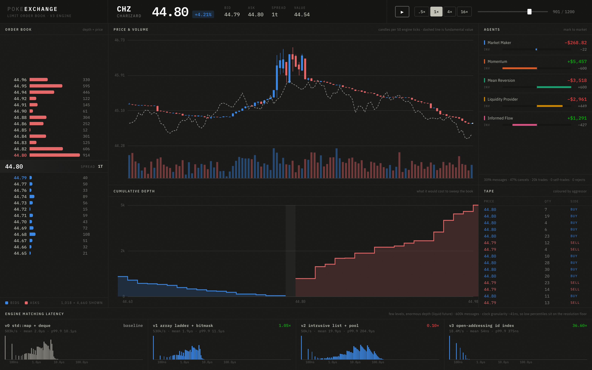
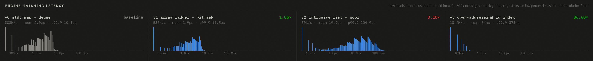
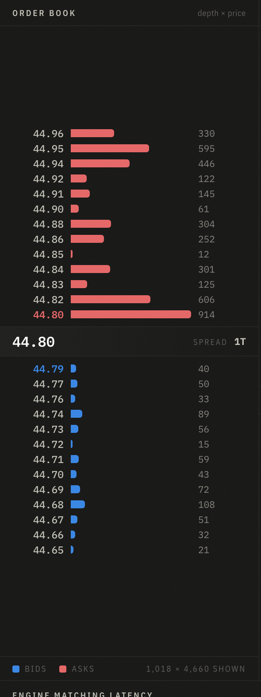

# PokeExchange

A limit order book and matching engine in C++20, with price-time priority, four
interchangeable book implementations, a population of trading bots, and a
terminal UI to watch it all happen. Every Pokemon species is meant to be a
tradeable instrument. Right now there is one of them.

**[Live demo](https://adammhal.github.io/pokeexchange/)** (replays a recorded
session, no server needed)



## What works

- Limit and market orders, price-time priority, FIFO within a price level
- Immediate-or-cancel, fill-or-kill, and post-only
- Modify, with the priority rules that make it interesting
- Self-trade prevention
- Multiple instruments, one book each
- Partial fills with correct residual handling, cancel, and typed rejections
- Four book implementations behind one compile-time seam, all passing the same
  test suite and all producing byte-identical output
- A benchmark that measures them honestly and refuses to report anything if
  they disagree, plus a simulated cache profile that explains the result
- Five trading agents generating realistic, cancel-heavy order flow
- Deterministic everywhere: same input bytes give the same output bytes, and
  the same seed gives the same session

Not yet: Avellaneda-Stoikov market making, the arbitrage bot, the Pokemon
fundamentals, and the stylized-facts analysis.

## Build and test

Needs CMake 3.20+, a C++20 compiler, and Python 3. Catch2 is fetched on first
configure, so that step needs a network connection.

```sh
cmake -S . -B build
cmake --build build -j
ctest --test-dir build --output-on-failure
```

Run the engine directly:

```sh
printf 'N 1 S L 101 50\nN 2 S L 102 150\nN 3 B M 0 400\n' | ./build/pokex-replay
```

```
A 1 1
A 2 2
A 3 3
T 1 3 101 50 3     <- 50 filled at 101, the resting order's price
T 2 3 102 150 3    <- then 150 at 102, walking up the book
X 3 200            <- 200 left over, cancelled, nothing else to hit
```

Generate a session and open the UI:

```sh
./build/pokex-sim   --seed 42 --ticks 60000 --out ui/data/session.js
./build/pokex-bench --messages 600000       --json ui/data/bench.js
open ui/index.html
```

The UI is plain HTML, CSS and JavaScript with no build step and no dependencies,
and it reads its data from script tags rather than fetch, so opening the file
directly works. Space toggles playback, arrow keys step one frame, and `#f=900`
in the URL parks it on a given frame.

With sanitizers:

```sh
cmake -S . -B build-asan -DCMAKE_BUILD_TYPE=Debug -DPOKEX_SANITIZE=ON
cmake --build build-asan -j
ctest --test-dir build-asan --output-on-failure
```

## Order types and the rules that go with them

| Type | Behaviour | The problem it solves |
|---|---|---|
| Limit | Trade at your price or better, rest the remainder | Never a bad price, but possibly no fill |
| Market | Trade until filled at any price, cancel the remainder | Certainty of getting done |
| IOC | Take what is there now, cancel the rest rather than resting | Taking liquidity without showing your hand |
| FOK | The entire quantity immediately, or nothing at all | When a partial fill is worse than none, like one leg of a hedge |
| Post-only | Must rest; rejected if it would trade | Guarantees maker status, and the rebate that comes with it |

**Modify** is the one worth reading the code for. One rule generates all three
cases: an order keeps its place in the queue exactly as long as it has not
increased the risk anyone else is taking on its behalf.

| You want to | Priority | Because |
|---|---|---|
| Reduce quantity | Kept | Asking for less harms nobody behind you, so there is nothing to charge |
| Increase quantity | Lost | The extra size never waited |
| Change price | Lost | You have never queued at the new price at all |

Losing priority is implemented as a cancel plus a fresh insert, in terms of
primitives that already existed, rather than as a third code path that could
drift out of agreement with them. Keeping priority needs the opposite,
mutation in place, which is why the book contract exposes `find` returning a
pointer rather than a copy.

**Self-trade prevention** cancels the incoming order and leaves the resting one
alone. That has a consequence worth knowing rather than discovering: a
participant's own resting order shields everything behind it from that
participant. The interaction that took the most care is with fill-or-kill,
whose feasibility check has to apply prevention too. Otherwise a FOK gets
judged fillable using liquidity it can never reach, is accepted, and then stops
half way, leaving exactly the partial fill it promises never to produce.

## The four books

Each version changes exactly one thing, so a measured gain can be attributed to
a specific cause rather than to a rewrite.

| | Change | Cancel path afterwards |
|---|---|---|
| **v0** | `std::map` of `std::deque` | hash to (side, price), then scan that level |
| **v1** | levels become an array indexed by tick, with an occupancy bitmask for best-price lookup | unchanged, still a scan |
| **v2** | queues become intrusive linked lists over a preallocated pool, so steady state never allocates | still walks the level |
| **v3** | open-addressing hash from order id straight to a pool slot | one probe, then an O(1) unlink |

## Benchmark



Which version wins depends entirely on the shape of the book, so reporting one
number would misrepresent all of it. 500,000 resting orders, 600,000 timed
messages, throughput relative to v0:

| book shape | orders per level | v1 | v2 | v3 |
|---|---|---|---|---|
| wide and thin | 8 | 1.75x | 1.07x | 3.21x |
| moderate | 122 | 1.27x | 0.37x | 5.28x |
| few levels, very deep | 7,812 | 1.05x | 0.10x | **36.60x** |

Two things in there are worth more than the headline number.

**v2 on its own is a regression.** An intrusive list over a shared pool has
worse traversal locality than a deque's contiguous blocks, so walking a deep
price level got slower, not faster. It earns its place only as the substrate
that makes v3 possible.

**v3 stays between 13.6M and 18.4M messages per second whatever the book looks
like**, while v0 degrades 8.5x and v1 degrades 14.1x going from wide to deep.
O(1) cancel makes throughput close to invariant to book geometry, and since
cancels are roughly 90% of real message traffic, that is the change that
actually matters.

### Why those numbers come out that way

`perf stat` cannot read hardware counters on a virtualised CI runner, so the
cache evidence comes from valgrind, which simulates a cache instead. These are
therefore modelled figures rather than measurements: the direction and
magnitude are meaningful, the absolute values are not a claim about any real
CPU. Collection starts after the book is built, so construction is excluded.
It runs on every push, and the table lands in the Actions summary.

| book | instructions | data refs | D1 misses | D1 miss rate | D1 vs v0 |
|---|---|---|---|---|---|
| v0 | 134.3M | 56.0M | 3,386,802 | 6.0% | baseline |
| v1 | 172.4M | 54.4M | 2,234,652 | 4.1% | 0.66x |
| v2 | 134.2M | 37.6M | 2,638,815 | 7.0% | 0.78x |
| v3 | 110.6M | 28.4M | 960,802 | 3.4% | 0.28x |

This is the part that turns the throughput table from an assertion into an
explanation, and each row says something different:

**v1 buys cache misses with instructions.** A third fewer D1 misses, but 28%
more instructions executed, because the bitmask scan and the index arithmetic
are not free. That is exactly why its throughput gain is a modest 1.27x rather
than the transformation the miss rate alone would suggest.

**v2 touches less memory and misses more often.** A third fewer data references,
because an intrusive list has less bookkeeping to read than a deque, yet the
worst miss rate of the four at 7.0%. That is the locality problem measured
directly and independently of the timings: a shared pool scatters a price
level's nodes, where a deque keeps them contiguous.

**v3 wins on every axis at once.** Fewest instructions, fewest data references,
lowest miss rate, and 0.28x the D1 misses. That is what resolving an order id
in one probe instead of walking a level buys you.

Latency percentiles come with a caveat that is printed alongside them:
`steady_clock` on Apple silicon is backed by a 24MHz timer, so it advances in
steps of about 41ns. An operation taking 50ns cannot be timed individually
against a clock that coarse, so p50 sits on the resolution floor and says
nothing. Throughput and mean come from bulk timing with no per-call clock and
are the numbers to trust. p99.9 and max resolve real outliers, including the
pool and the hash table doubling in size.

One cost worth naming, because it is easy to miss: **v1's construction time is
proportional to the price domain, not to the number of orders.** It builds
65,536 `std::deque` levels per side, so a fresh engine costs a few megabytes of
writes before it has seen a single order. That is irrelevant in production,
where you construct the book once and run it all day, but it made the
differential test 68x slower than v0 because that harness builds a fresh engine
per flow. v2 and v3 avoid it because a price level there is just two integers.

The first version of this benchmark was worthless and the reason is in the git
history: it used 201 price levels and a few thousand resting orders, so v0's
`std::map` fit entirely in L1 cache and every price level held about a dozen
orders. Under those conditions none of the three optimisations can show an
advantage, and it duly reported v1 at 1.02x.

## The agents



Five agents, and every one of them is either a maker or a taker, never both:

- **Market maker** quotes both sides and skews both quotes against its own
  inventory, so a long position produces cheaper offers and stingier bids
- **Liquidity provider** posts the depth behind it, strictly passively
- **Informed flow** can see fundamental value and picks off stale quotes
- **Momentum** and **mean reversion** trade the trend and fade it

They produce about 309,000 messages per session at 47% cancels, with zero wash
trades and zero rejects.

Three modelling bugs are worth recording, because each one produced a market
that looked plausible and was wrong:

1. A single noise agent that both posted limits and sent market orders spent
   28% of all trades trading with itself. Fixed by splitting it into a strictly
   passive agent and a strictly aggressive one, which makes "no agent trades
   with itself" a real invariant rather than a hope.
2. The provider never cancelled, so the book grew without bound and it ended up
   holding 65,592 units. It now ages its oldest quotes out, which is also what
   makes the message mix realistically cancel-heavy.
3. The market maker derived its reservation price from the mid. The mid comes
   from the book, and the maker's post-only quotes sit at the top of the book,
   so it was quoting around its own quotes. That loop has no exogenous anchor
   and random-walked 21% away from fair value. It now prices off a lagged,
   noisy estimate of fundamental value, and the lag is the point: the maker
   learns fair value slowly while informed flow sees it at once, which is
   exactly the adverse selection a real maker is paid to bear.

## How it is tested

Four layers, weakest to strongest:

1. **Golden tests.** Hand written scenarios with expected event streams,
   covering things like the rule that a trade prints at the maker's price and
   not the taker's.
2. **Property tests.** A million random messages per book version, asserting as
   it goes that the book never crosses, that priority ordering holds, and that
   for every order `filled + cancelled + resting == original`. That last check
   compares the book's own state against accounting derived purely from emitted
   events, so two independent views have to agree.
3. **Cross-version equivalence.** All four books produce identical event streams
   on the same flows. Without this the benchmark would be comparing
   implementations that did different work.
4. **Differential tests.** Each book is run against an independently written
   Python reference over 10,000 random flows and the output has to be byte
   identical. Two independent implementations agreeing is much stronger evidence
   than any suite I would have thought to write.

The invariant tests were also checked by breaking the engine on purpose in five
different ways and confirming each one gets caught. A test that has never failed
has not been shown to work.

313 tests, clean under AddressSanitizer and UndefinedBehaviorSanitizer.

## Design decisions worth knowing

**Prices are integers, never floats.** A price is a count of ticks. Exact
equality is required for price-time priority, and `0.1` has no exact binary
representation, so with floats a price level can silently split in two. It also
means a price can be used directly as an array index, which is what v1 needs.

**No clock, no randomness, and no allocation-dependent iteration in the engine.**
Time is a counter that ticks once per accepted message. This buys determinism,
which is what makes replay testing, the Python diff, and an honest benchmark
possible at all. The simulator owns the virtual clock; the engine never sees one.

**The book is swapped at compile time.** `MatchingEngine<Book>` is a template, so
the matching logic is written once and each version plugs in underneath. A
virtual base class would have been the obvious move and the wrong one, since an
indirect call on the hot path would mean benchmarking the abstraction instead of
the data structure.

**Rejections are data, not exceptions.** The engine never throws and never logs.
Bad input produces a `Rejected` event and the book is untouched. A function that
can throw halfway through a match can leave the book half updated, and there is
no recovering from that.

## Layout

```
include/pokex/
  types.hpp             Price, Quantity, OrderId, Side, Order, Sequence
  events.hpp            commands in, events out
  book_concept.hpp      the five operations a book has to provide
  book_v0_map.hpp       std::map + std::deque. The baseline, kept forever
  book_v1_ladder.hpp    array indexed by tick + occupancy bitmask
  book_v2_pool.hpp      intrusive lists over an object pool
  book_v3_hash.hpp      open-addressing id index, O(1) cancel
  detail/ladder_pool.hpp  machinery shared by v2 and v3
  matching.hpp          the matching loop, written once against the concept
  exchange.hpp          one book per instrument, and the router in front
  text_codec.hpp        the replay file format
  sim/simulator.hpp     agents, virtual clock, session recording
src/                    replay, sim, bench and profile CLIs
reference/engine.py     independent Python implementation
tests/                  golden, order types, modify, self-trade, exchange,
                        property, equivalence, differential, determinism
tools/                  the cache profile summariser
ui/                     the terminal. No build step, no dependencies
docs/explainer/         a 41 page primer on how all of this works
docs/superpowers/       design specs
```

## Roadmap

| | | |
|---|---|---|
| A1 | engine core | done |
| C1 | v1 to v3, benchmark harness | done |
| B1 | trading agents, recorded sessions | done |
| D1 | terminal UI | done |
| A2 | IOC, FOK, post-only, modify, self-trade prevention, multi-instrument | done |
| E | Avellaneda-Stoikov market maker, arbitrage bot, Pokemon fundamentals | next |
| F | stylized facts analysis: fat tails, volatility clustering, market impact | |

## Reading

`docs/explainer/pokeexchange-explainer.pdf` explains the whole thing from
scratch with no finance background assumed: what an order book is, how matching
works, why memory layout ends up mattering more than big-O, and the maths behind
the agents that are still to come.
